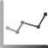

# Visualization Element: Cartesian XY Chart

Symbol:

Category: **Special Controls**

The element graphically displays the curve of array values as a line or bar chart in the Cartesian coordinate system. The chart can display multiple curves at one time.

IMPORTANT:

**Constraint**

The element can be used with controller with V3.5 SP11 and higher.

17.0

© Copyright 2026, CODESYS GmbH