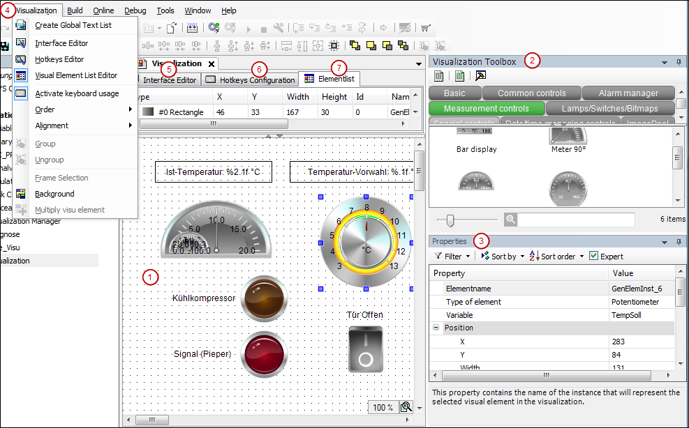

# User Interface

* Visualization editor: Here you create and edit your visualization from visualization elements.
* **[Visualization ToolBox](_visu_view_toolbox.html#_visu_view_toolbox)**  view: Provides the installed visualization elements
* **[Properties](_visu_view_element_properties.html#_visu_view_element_properties)**  view: For the configuration of a visualization element selected in the editor area
* **Visualization** menu: Commands for working in the visualization editor
* **[Interface editor](_visu_cmd_interface_editor.html#_visu_cmd_interface_editor)** : In this editor, you declare the interface of a visualization page which is referenced by the frame element (or tab element) of a superordinate visualization. You declare parameters (interface variables) which are specified by the calling visualization instance.
* **[Hotkeys Configuration](_visu_cmd_hotkeys_editor.html#_visu_cmd_hotkeys_editor)** : Definition of shortcuts for user input on the visualization in online mode
* **[Element list](_visu_cmd_element_list.html#_visu_cmd_element_list)** : List of all elements which are used in the visualization with the possibility of editing their position on the Z-axis

17.0

© Copyright 2026, CODESYS GmbH