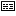
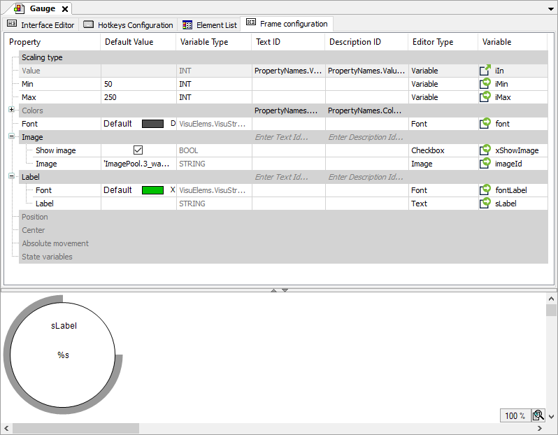

# Tab: Frame Configuration

Symbol: 

**Function**: The tab provides an editor for configuring the frame interface of the visualization opened below. This editor is used to define properties for the frame interface and then configure each in detail. If the visualization is referenced in a superordinate visualization with a frame, then the actual values can be configured there by means of the properties configured here, which act as transfer parameters. The frame with the referenced visualization then presents itself just like a visualization element and is supported by the same editors.

**Call**: Automatic when the visualization object is opened

TIP:

In order to keep the frame interface of a visualization clear, we recommend that you pass as few as possible standard frame properties as parameters.

When a visualization with a frame interface is referenced by another visualization by means of a frame element, it brings with it the properties displayed here in the tree view. In the referencing visualization, it then presents itself like an ordinary visualization element: with properties categorized and arranged hierarchically. And with editors to help you specify the value with editors that match the data type.

Description of the columns

|  |  |
| --- | --- |
| Hierarchical **tree view** with categories | Corresponds to the **Properties** view of a visualization element  A frame interface consists of properties which can be thematically grouped and hierarchically arranged using categories. |
| **Element description** | Description which is displayed in the visualization editor when using the visualization as a reference in a frame |
| **Property** | Externally visible property represented as a node of the hierarchical **tree view**  Node types:   * Category nodes, including subordinates:    + With identifier (category name)   + Without configuration  A category combines properties into one category, similar to a container (without being able to store values).   + Allows for the hierarchical structuring of properties Example: `Image`, `Label` * Nodes, including subordinates:    + With identifier (property names)   + With configuration in the columns of the tree view, therefore displayed in normal font Example: `Show image`, `Image` * Standard property nodes    + Selected from the properties of the frame   + In grayed out font to indicate that the configuration is at the frame element, not here   + The default **Position**, **Center**, **Absolute movement**, and **State variables** properties are always added to the interface (by default).   + You can add the **Forward inputs** standard property.  If the **Input configuration** standard property is also used, then inputs are forwarded both to the frame itself and to the referenced visualization. |
| **Default Value** | Displayed in the **Properties** view under **Value** (if nothing else has been configured there)  According to the variable type as literal or variable  Example: `250` |
| **Variable Type** | Variable type of the property, selected from the data types available project-wide (base data types, user-defined data types, function blocks, library POUs)  Example: `INT`, `PropertyNames.Colors` |
| **Text ID** | ID from a project-wide text list to localize the name of the property  Example: `PropertyNames.Value` |
| **Description ID** | ID from a project-wide text list which refers to a description of the property  Example: `PropertyNames.Value_Desc` |
| **Editor Type** | Type of inline editor which will open when configuring the element property of the frame:  Editor for **Text**, **Variable**, **Color**, **Font**, **Text Box**, **Test List**, **Image**, or **Combo Box** |
| **Variable** | Link to the interface variable or project variable  Example: `iIn`, `iMin`, `iMax`, `font`, `font.Label`, `sl.Label` |

**Example: `Gauge` visualization**

Frame configuration of `Gauge` 

The frame interface of `Gauge` hat the following properties as parameters: `Scaling type`, `Value`, `Min`, `Max`, `Colors`, `Font`, `Image`, and `Label`. In addition, the default `Position`, `Center`, `Absolute movement`, and `State variables` properties can be parameterized.

17.0

© Copyright 2026, CODESYS GmbH