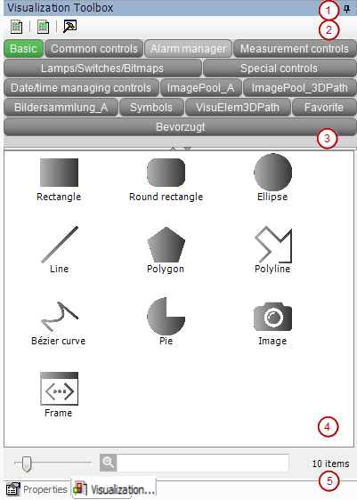

# View: Visualization Toolbox

Symbol: 

**Function**: The view provides the visualization elements which you can insert into the active visualization editor.

**Call**: **View** menu

**Requirement**: The visualization editor is active.

* View: **Visualization Toolbox**
* Toolbar with commands
* Buttons for the element categories to show or hide with one click the categorized elements in the visualization elements view
* Visualization element view

  You can drag an element from the view to the editor to add it to the active visualization there.

  To limit the element selection, you can filter the view by categories or by element names.
* + Slider bar to adjust the size of the thumbnails in the visualization element view
  + Text filter to search in the element names for the specified text

17.0

© Copyright 2026, CODESYS GmbH