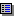

# View: Properties

Symbol: 

**Function**: The view is used for configuring the element properties of the selected visualization element.

**Call**: **View → Element Properties** menu

17.0

© Copyright 2026, CODESYS GmbH