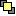

# Command: Bring to Front

Symbol: 

**Function**: The command positions the selected visualization element on the top layer. The element becomes completely visible.

**Call**: **Visualization → Order** menu; context menu

17.0

© Copyright 2026, CODESYS GmbH