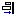

# Command: Align Right

Symbol: 

**Function**: The command aligns the selected visualization elements in a line through the right edge of the element positioned furthest to the right.

**Call**: **Visualization → Alignment** menu; context menu

**Requirement**: Multiple elements are selected.

17.0

© Copyright 2026, CODESYS GmbH