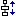

# Command: Increase Vertical Spacing

Symbol: 

**Function**: The command aligns the selected visualization elements so that the blue element keeps its position and the other elements are positioned vertically with more space between them. The spacing increases by one pixel.

**Call**: **Visualization → Alignment** menu; context menu

**Requirement**: Multiple elements are selected.

17.0

© Copyright 2026, CODESYS GmbH