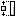

# Command: Make Same Height

Symbol: 

**Function**: The command adjusts the height of the selected visualization elements to the height of the blue selected element.

**Call**: **Visualization → Alignment** menu; context menu

**Requirement**: Multiple elements are selected. The first element is blue and the other elements are gray.

TIP:

The command does not work for lines or polygons.

17.0

© Copyright 2026, CODESYS GmbH