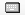

# Tab: Keyboard Configuration

Symbol: 

The tab contains a list of hotkeys with an editing option.

A hotkey can refer specifically to an element. Then the configuration appears here and in the **Input configuration** property of the associated element.

A hotkey can also have multiple configurations. If a hotkey has multiple keyboard configurations, then its input actions are executed in the order listed here.

Hotkeys of the standard keyboard handling are **not** listed here.

|  |  |
| --- | --- |
| **Key** | Key that a keyboard configuration is defined  Example: **M**  NOTE: You can combine the key with **Ctrl**, **Alt**, and/or **Shift**. |
| **Press key** | : The input action is executed when the user presses the key.  : The input action is executed when the user releases the key.  Double-click: List box of all keys.  NOTE: If the input action should be executed for both pressing the key (`KeyDown`) and releasing the key (`KeyUp`), then you must define a keyboard configuration for both input actions. |
| **Shift** | : The input event is triggered for **Shift**+**key**. |
| **Ctrl** | : The input event is triggered for **Ctrl**+**key**. |
| **Alt** | : The input event is triggered for **Alt**+**key**. |
| **Action type** | Input action  Double-click: List box of input actions.  TIP: For a description of input actions, see the **Input Configuration** dialog. |
| **Action** | Configuration of the input action that was selected next  Double-click: A dialog opens that varies according to the input action. It allows the user-prompted customization of the settings.  TIP: For a description of dialogs, see the **Input configuration** dialog. The input action is configured in the same way here. |
| **Element ID** | ID of the visualization element where the user can execute the key event. The ID is relevant only if the event is also assigned to an element.  TIP: The assignment of ID to element name is listed on the **Element List** tab. |
| **Access Rights** | Access privileges of the action per user group  Requirement: The visualization has a user management. |

|  |  |
| --- | --- |
|  | Clicking the symbol on the right of the list moves the selected row one line down. |
|  | Clicking the symbol on the right of the list moves the selected row one line up. |
| Blank line | Allows adding a new keyboard configuration. |

17.0

© Copyright 2026, CODESYS GmbH