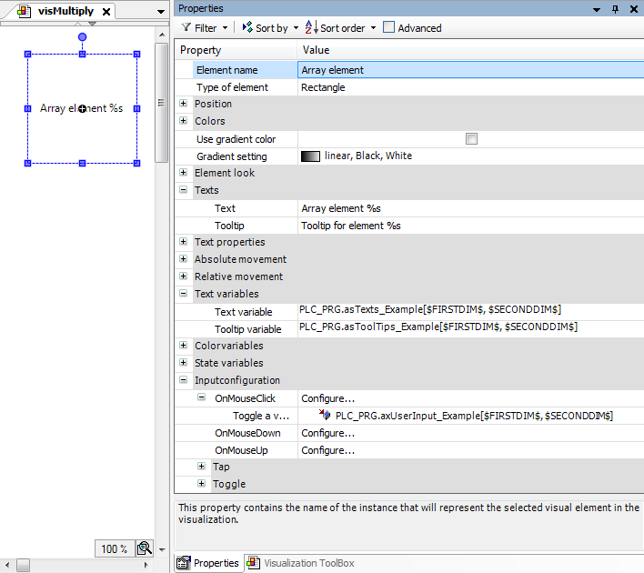
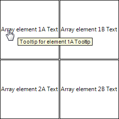

# Dialog: Multiply Visu Element

Tab: Basic Settings

|  |  |
| --- | --- |
| **Total number of elements** | The total number is determined by the index range of the placeholders, including the setting on the **Advanced Settings** tab. The layout of the elements can be one-dimensional (as a column or row) or two-dimensional (as a table field). |
| **Horizontal** | Number of elements per row  Default: Number of array components (index range) of the placeholder `$FIRSTDIM$`  Example for array: `axLampIsOn: ARRAY[0..4] OF BOOL;` = `5` |
| **Vertical** | Number of rows required for the layout of all elements  **Default**   * When using index access placeholder `$FIRSTDIM$`:  If the index range of the placeholder is less than five, then the layout of elements is horizontal. If the index range is greater than five, then the layout the elements is quadratic whenever possible. * When using index access placeholders `$FIRSTDIM$` and `$SECONDDIM$`:  The number of horizontal elements is equal to the number of index ranges specified by the placeholder `$FIRSTDIM$`. The number of vertical elements is equal to the number of index ranges specified by the placeholder `$SECONDDIM$`. |
| **Offset between elements** | Distance between the new elements; affects the positions of the new elements   * **0**: The frames of the elements overlap by one pixel. * **1**: The elements touch. * **<n>**: A distance of n-1 pixel is visible between the elements. |
| **Horizontal** | Distance between the elements within a row (in pixels)  Example: `2` for a distance of one pixel |
| **Vertical** | Distance between the elements within the columns (in pixels)  Example for a distance of three pixels: `4` |
| **Arrangement of elements** | Origin from which the new elements are positioned and arranged  **If **Vertical** or **Horizontal** <> 1**   * **From top left** * **From top right** * **From bottom left** * **From bottom right**   **If **Horizontal** or **Vertical** = 1**   * **From top** * **From bottom** |
| **Orientation** | Determines the layout of the elements in the field (row by row, or column by column)   * **Line by line** * **Column by column** |
|  |  |
| **Preview** | Displays the set layout and orientation of the elements as an arrow |

Tab: Advanced Settings

|  |  |
| --- | --- |
| **Array access** | Based on the template element, the precise index for accessing the array variable is calculated for each new element. The calculation is based on the array index limits as specified in the array declaration. The settings are also taken into account here. |
| **1st dimension** | Calculation guideline for the index of the first dimension that replaces `$FIRSTDIM$`  The first new element gets the value specified below in **Start index** in the first dimension. The other elements each get an index incremented by **Increment** until an index is calculated for all elements.  **Example (preset)**   * **Start index**: `1` * **Increment**: `1` |
| **2nd dimension** | Calculation guideline for the index of the second dimension that replaces `$SECONDDIM$`  The first new element gets the value specified below in **Start index** in the second dimension. The other elements each get an index incremented by **Increment**.  **Example**   * **Start index**: `1` * **Increment**: `1` |

|  |  |
| --- | --- |
| **OK** | First, it is validated whether the calculated indices are in the index range of the array variable. If so, then the elements that match the template element are created and arranged as a field (row, column, or table). The placeholder indexes are replaced by the calculated indexes. |

**Example**

Declaration of array variables

```
VAR
asTexts_Example: ARRAY[1..2,1..2] OF STRING :=
        [
                '1A Text', '2A Text',
                '1B Text', '2B Text'
        ];
        asToolTips_Example: ARRAY[1..2,1..2] OF STRING :=
        [
                '1A Tooltip', '2A Tooltip',
                '1B Tooltip', '2B Tooltip'
        ];

        axUserInput_Example: ARRAY[1..2,1..2] OF BOOL;
END_VAR
```

Visualization with template element and its property configuration



Dialog: Multiply Visu Element

|  |  |
| --- | --- |
| Tab **Basic Settings** |  |
| **Total number of elements** |  |
| **Horizontal** | `2` |
| **Vertical** | `2` |
|  |  |
| **Offset between elements** |  |
| **Horizontal** | `2` |
| **Vertical** | `2` |
|  |  |
| **Arrangement of elements** | **From top left** |
| **Orientation** | **Line by line** |

|  |  |
| --- | --- |
| **Extended Settings** Tab |  |
| **Array access** |  |
| **1st dimension** |  |
| **Start index** | `1` |
| **Increment** | `1` |
| **2nd dimension** |  |
| **Start index** | `1` |
| **Increment** | `1` |

Visualization at runtime:



17.0

© Copyright 2026, CODESYS GmbH