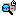

# Command: Configure Trace

Symbol: 

**Function**: The command opens the **Trace Configuration** dialog.

**Call**: Context menu of the visualization element, then **Trace** property of the visualization element

**Requirement**: An element of type **Trace** is open in the editor.

17.0

© Copyright 2026, CODESYS GmbH