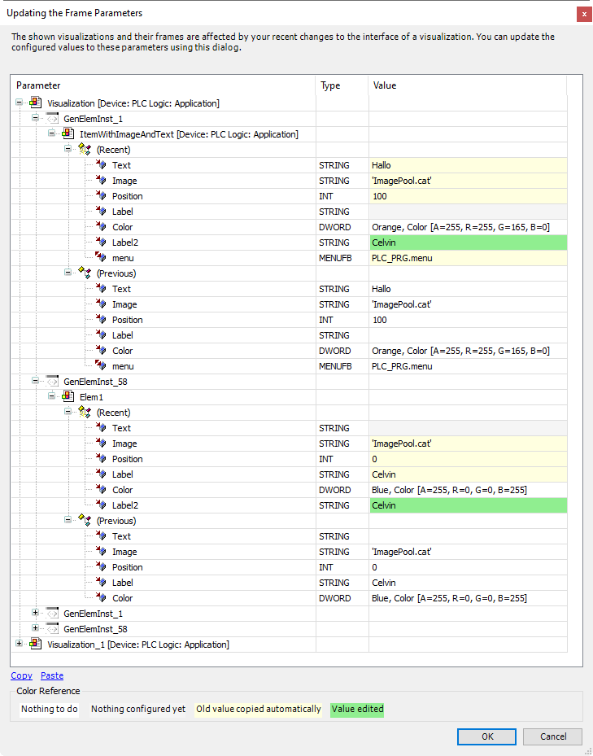
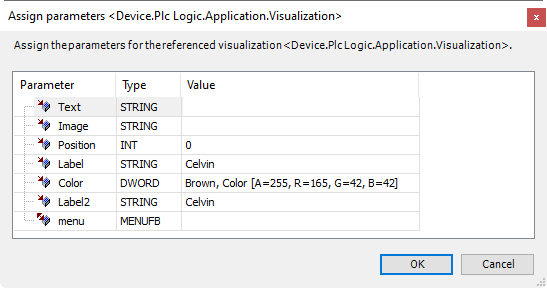

# Example

Dialog which opens when all frame parameters of the current project are updated:

Dialog which opens when the frame parameters of the current frame (of the current tab element) are updated:

17.0

© Copyright 2026, CODESYS GmbH