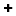

# Dialog: Add Category

**Call**: Click the  symbol in the **Configure Categories and Items** dialog

|  |  |
| --- | --- |
| **Name** | Name of the category  Example: `tagA` |
| **Description** | Example: `Tagged with A` |

17.0

© Copyright 2026, CODESYS GmbH