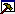

# Dialog: Configure Categories and Items

**Function**: Manages the categories in a tree view. The assigned elements are listed below a category. You can create custom categories and edit the assignment to the visualization elements. The name of the category is displayed in the **Visualization ToolBox** view as a label of the button to open the element selection.

**Call**: Click the  symbol in the **Visualization ToolBox** view

17.0

© Copyright 2026, CODESYS GmbH