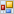

# Dialog: Input Configuration

Symbol: 

**Function**: The dialog allows you to assign an input action to an input event and to configure the input action.

**Call**: **Configure** button in the **Input configuration** property

**Requirement**: An element is selected in the editor.

TIP:

**Are all element properties available?**

All properties are available only after you select the **Advanced** option or the **All categories** filter in [View: Properties](_visu_view_element_properties.html#_visu_view_element_properties).

17.0

© Copyright 2026, CODESYS GmbH