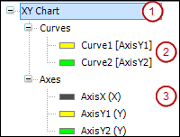

# Dialog: XY Chart Configuration

Symbol: 

**Function**: The dialog contains the configuration of the **Cartesian XY Chart** which displays the data from an array.

**Call**: In the **Cartesian XY Chart** property, click  **XY Chart**.

**Requirement**: An XY chart is selected in the active visualization editor and the respective **Properties** view is open.

The tree view to the left of the dialog displays the configuration of the XY chart and acts as a navigator. If you have selected the top-level entry (1) or nothing at all, then the **Element Settings** group is visible on the right. This includes the configuration of how often the chart is refreshed. Moreover, settings are available which influence the appearance and functionality of the chart.

If you have selected an entry below the **Curves** node (2), then the **Curve Settings** group is visible on the right. This configuration includes the Y-coordinate axis assigned to the selected curve and the array data that the curve displays. Moreover, settings are available that influence the appearance and functionality of the selected curve. The entry shows the name of the curve with the assigned coordinate axis in parentheses. For example, `Curve1 [AxisY1]` means that the vertical ordinate axis `AxisY1` is assigned to the curve `Curve1`.

If you have selected an entry below the **Axes** node (3), then the **Axis Settings** group is visible on the right. This configuration includes the location of the Y-coordinate axis in the chart. Moreover, settings are available that influence the appearance and functionality of the selected coordinate axis. The entry shows the name of the axis with its function in parentheses. An axis can act as either an X- or Y-axis. For example, `AxisX(X)` means that the axis `AxisX` acts as a horizontal abscissa axis `X`.

|  |  |
| --- | --- |
| **Add** | Adds a new entry to the view  Result: An empty configuration is displayed next to the new curve or axis. You edit the settings there. |
| **Delete** | Removes the selected entry |
| **Move Up** | Moves the selected entry up one position |
| **Move Down** | Moves the selected entry down one position |

|  |  |
| --- | --- |
| **OK** | Saves the settings, closes the dialog, and displays the element according to the settings |

17.0

© Copyright 2026, CODESYS GmbH