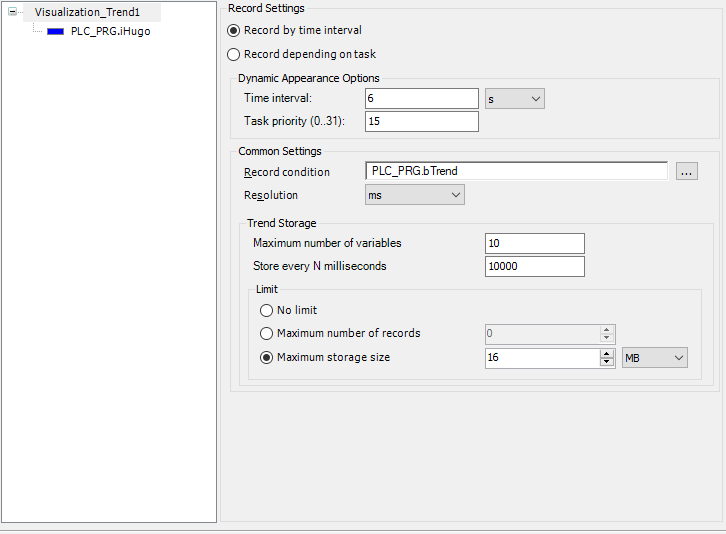

# Configuring an Interval-Based Recording

In the case of interval-based recording of data, this is done at a fixed time interval, which is set to 10 s by default. You can adjust the time interval.

TIP:

Recording by time interval is simpler and therefore less prone to error. You do not have to specify a task for recording.

Whenever possible, use this type of trend recording.

1. Double-click a **Trend Recording** object in the device tree.

   * The corresponding editor opens. In the tree view of the trend configuration, the top entry is selected, and on the right you see the current configuration in **Record Settings**.
2. Below **Interval Settings**, specify a time in the **Time interval** input field. The values of the variables will be recorded in this time interval.

   * The recording is done synchronously.

     Example:

     

17.0

© Copyright 2026, CODESYS GmbH