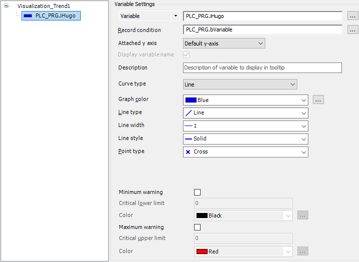

# Adding IEC variables

1. In the device tree, double-click a  **Trend Recording** object.

   * The corresponding editor opens. In the tree view of the trend configuration, the top entry is selected, and on the right side you see the current configuration in **Record Settings**.
2. Define the **Curve type** and the display.

   * Example:

     

17.0

© Copyright 2026, CODESYS GmbH