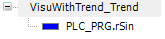
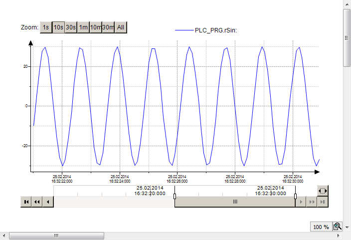

# Getting Started with Trend Visualization

When you execute a trend, it is best to proceed with user guidance and the help of the trend wizard.

**Development of a visualization with trend**

1. Create an empty standard project and program at least one variable into `PLC_PRG`.

   * `PLC_PRG` is declared and implemented
2. Start the application with **F5**.

   * The target visualization appears. The visualization contains the trend diagram with the value curve of the variable. The controls enable user inputs.

**Visualization of the sinusoidal trend of an IEC variable**

**The following objects are implemented in the project:**

* `PLC_PRG`
* `Visualization_Trend1`
* `VisuWithTrend`

The `PLC_PRG` program runs as part of the application on the controller.

```
PROGRAM PLC_PRG
VAR
    iVar : INT;
    rSin : REAL;
    rVar : REAL;
END_VAR
iVar := iVar + 1;
iVar := iVar MOD 33;
rVar := rVar + 0.1;
rSin := 30 * SIN(rVar);
```

**`Visualization_Trend1`**

`Visualization_Trend1` is the object that contains the configuration of the trend recording.



**`VisuWithTrend`**

`VisuWithTrend` is the object that displays the trend.

The visualization contains four elements: one **Trend** and three controls. The properties of the trend are defined as follows.

| Properties | Value |
| --- | --- |
| **Trend recording** | Visualization\_Trend1 |
| **Show cursor** |  |
| **Show tooltip** |  |
| **Show frame** |  |
| **Date Range Picker** | : Trend1DateRangeSelector |
| **Time Picker** | : Trend1TimeSelector |
| **Legend** | : Trend1Legend |

`VisuWithTrend` at runtime



17.0

© Copyright 2026, CODESYS GmbH