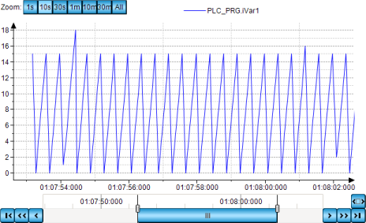

# Labeling the time axis

TIP:

The time stored in the trend recording are in the UTC time zone. If the time is displayed in the trend of the visualization element, then the timestamps are converted to the local time zone of the operating system of the PLC.

Change the time zone in the operating system if the times in the trend diagram are not in the zone that you need.

Requirement: A **Trend** element is configured in the visualization.

1. Select the trend element.

   * The properties of the trend element are displayed in the **Properties** view. You can adapt the properties.
2. **Configure the properties in **Tick mark labels** as follows:**

   * **Time stamps**: **Relative time stamps**
   * **Draw labels on two lines**: Not selected
   * **Omit irrelevant information in timestamps**: Not selected
   * **Internationalization (format strings)**, **Date**: Blank
   * **Internationalization (format strings)**, **Time**: `HH:mm:ss:ms`
   * The trend diagram is displayed as follows:

     

     The time starts at 0 because the timestamps are displayed relatively. The time axis is labeled with one line and corresponds to the format string.

17.0

© Copyright 2026, CODESYS GmbH