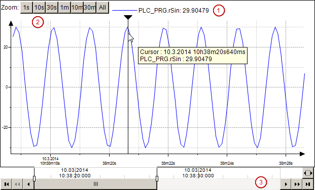

# Displaying Data Graphs with a Trend Element

A **Trend** visualizes data which is used in the database of a trend recording. In contrast to the **Trace** element, the **Trend** element is particularly suitable for long-term data sampling.

The visualization of a trend encompasses the **Trend** element and the controls. The three possible controls can be seen in the illustration.

* **Legend** ①: Outputs the trend variables with values.
* **Time Range Picker** ②: Provides buttons for selecting predefined time ranges.
* **Date Range Picker** ③: Encompasses controls for navigation and zooming in the historical and current data on basis of the set date range.

A cursor is optionally available that enables the reading of a value at a certain time.

**You can display a trend visualization in the following clients:**

* Target Visualization
* HMI: Communication is made via a data source manager.
* Integrated visualization

17.0

© Copyright 2026, CODESYS GmbH