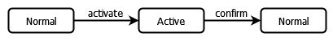
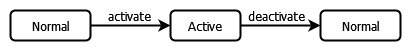
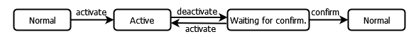
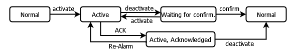
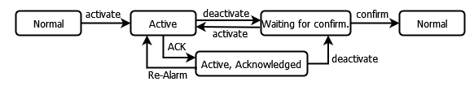

# Acknowledgement method

The acknowledgement method defines the expected alarm handling for the visualization user. The states and state transitions which an alarm of this class can have are defined by selecting the acknowledgement method.

**The initial situation is that an alarm has been triggered and is now active. Then the following acknowledgement methods are possible:**

* Acknowledgement method: **ACK**

  The visualization user acknowledges the alarm either with either "`ACK`" or "`confirm`". Then the alarm returns to its normal state. This is the method for events. ("**Events**")

  The following state transition chart shows the acknowledgement with "`confirm`".

  
* Acknowledgement method: **REP**

  After the visualization user has resolved (repair) the cause of the alarm, the alarm automatically returns to the normal state.

  
* Acknowledgement method: **REP\_ACK**

  After the visualization user has resolved (repair) the cause of the alarm, the system waits until the visualization user acknowledges this with "`confirm`". Then the alarm returns to its normal state.

  
* Acknowledgement method: **ACK\_REP**

  Situation 1: After the cause of the alarm has been resolved (and the alarm has been deactivated), the system waits for the visualization user to confirm with "`confirm`". If the alarm is triggered again during this time, then the alarm becomes active again and the visualization user must deactivate the alarm. Then the alarm returns to its normal state.

  Situation 2: The visualization user acknowledges the alarm with "`ACK`". The alarm goes into the "`Active, Acknowledged`" state until the cause of the alarm is resolved and the alarm is deactivated. In the meantime, the alarm can be triggered again. The visualization user must confirm this if it happens. Then the cause of the alarm can be resolved and the alarm can return to its normal state.

  The following state transition chart shows the flows for the two situations.

  
* Acknowledgement method: **ACK\_REP\_ACK**

  Situation 1: After the cause of the alarm has been resolved (and the alarm has been deactivated), the system waits for the visualization user to confirm with "`confirm`". If the alarm is triggered again during this time, then the alarm becomes active again and the visualization user must search again for the cause of the alarm and resolve it. When the visualization user confirms the resolution with "`confirm`", the alarm returns to its normal state.

  Situation 2: The visualization user acknowledges the alarm with "`ACK`". The alarm goes into the"`Active, Acknowledged`" state until the cause of the alarm is resolved and the alarm is deactivated. In the meantime, the alarm can be triggered again ("`Re-Alarm`"). The visualization user must confirm this if it happens. Then the visualization user must resolve the cause of the alarm. However, the alarm does not return to the normal state, but waits for acknowledgement. The alarm returns to its normal state only after the visualization user has confirmed with "`confirm`".

  

TIP:

When you move the mouse pointer over the possible acknowledgment methods in the expanded list box in the editor, the respective state transition chart is displayed on the right side.

17.0

© Copyright 2026, CODESYS GmbH