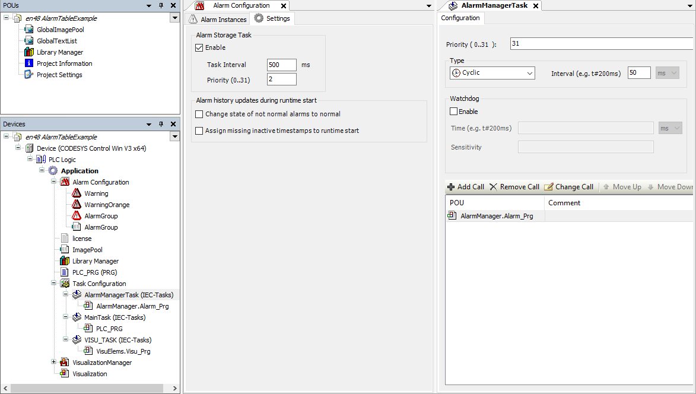

# Distributing the Alarm Management to Two Tasks

If the IEC task `AlarmManagerTask` is only responsible for evaluating alarms, then it can be operated with higher priority and frequency (shorter task cycle time). This means that alarm events which are about to occur can also be detected. The alarm information is stored in a separate alarm storage task, which is created automatically and is not visible in the task configuration.

If you want to do this, then enable the **Alarm Storage Task** option under the **Settings** tab in the editor of the [Object: Alarm Configuration](_cds_obj_alarm_configuration.html#_cds_obj_alarm_configuration) object. Configure the task cycle time and the priority for the task there. This option is already active for newly created projects.

NOTE:

Set a higher task cycle time and a lower priority for the alarm storage task than for the alarm manager task. The alarm storage task requires a slow frequency to execute file access to the alarm database.

**Example**

Configuring the Alarm Storage Task under the object `Alarm Configuration`

17.0

© Copyright 2026, CODESYS GmbH