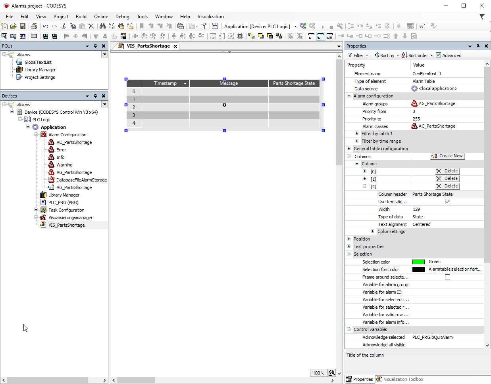

# Configuration

Requirement: The `AG_PartsShortage` alarm group and the `AC_PartsShortage` alarm class are defined in your project.

1. Add a visualization below your application.

   1. Select the application and click the **Add Object** → **Visualization** command.
   2. Specify the name as `VIS_PartsShortage`.
2. Configure the alarm table as follows.

   1. In the **Element name** property, in the **Value** column, specify the name `AT_PartsShortage`.
   2. Configuration of the `Alarm groups` visualization element property:

      1. In the **Alarm configuration** → **Alarm groups** property, click in the corresponding value cell.

         * The [Dialog: Selected Alarm Group](_visu_dlg_select_alarm_group.html#_visu_dlg_select_alarm_group) dialog opens.
      2. Clear the **All** option and select the `AG_PartsShortage` alarm group.
      3. Click the  button to add the group to the **Selected Alarm Group** list.
      4. Click **OK** to confirm the configuration.
   3. Configuration of the **Alarm classes** visualization element property:

      1. In the **Alarm configuration** → **Alarm classes** property, define the alarm classes which you want to visualize. Click into the value field.

         In the **Alarm configuration** → **Alarm classes** property, click in the corresponding value cell.

         * The [Dialog: Select Alarm Class](_visu_dlg_select_alarm_class.html#_visu_dlg_select_alarm_class) dialog opens.
      2. Clear the **All** option and select the `AC_PartsShortage` alarm class.
      3. Click the  button to add the alarm class to the selected alarm classes.
      4. Click **OK** to confirm the configuration.
   4. Configuration of a column:

      1. In the **Columns** property, click the **Create New** button.

         * Column **[2]** is available. The new column with the name `Bitmap` is listed in the visualization editor.
      2. In the **Type of data** property, select the **State** value for column [2].

         * In the table, the column is given the new default heading `State`.
      3. In the **Column header** property, specify the name `Parts Shortage State`.

         * Column [2] is renamed.
   5. Configuration of the **Selection** visualization element property:

      1. In the **Selection color** property, select the color `Green` in the **Value** column.

         * At runtime, the table cells can be selected by the visualization user. These then turn green.
   6. Configuration of the **Control variables** visualization element property:

      1. In your application code, declare the `bQuitAlarm` control variable.
      2. In the **Acknowledge selected** property, specify the `PLC_PRG.bQuitAlarm` variable in the value cell.
   * Configured properties

     

17.0

© Copyright 2026, CODESYS GmbH