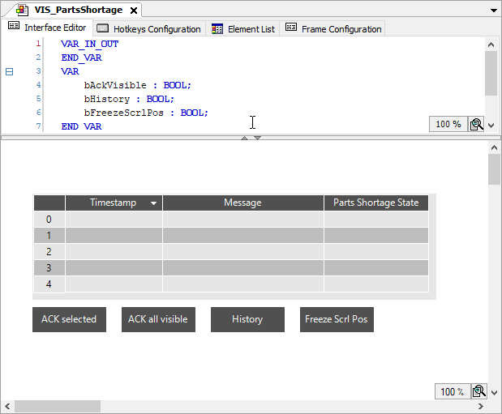

# Supplementing an alarm visualization with controls

The visualization user needs controls to operate the alarm visualization. When programming, you can get support from the Alarm Table Wizard. The command which calls the wizard is available only when you have selected an alarm table in the visualization.

1. In the visualization editor, select the alarm table  element.
2. Click **OK** to accept all settings.

   * The `Acknowledge selected`, `Acknowledge all visible`, `History`, and `Freeze scrolling position` buttons are added. The elements have a complete input configuration.

     

17.0

© Copyright 2026, CODESYS GmbH