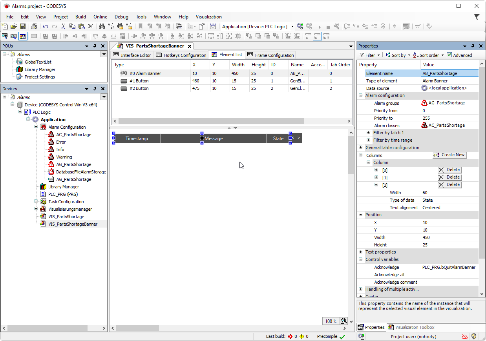

# Supplementing an alarm visualization with controls

The user of the alarm visualization needs controls to operate the alarm visualization. When programming the visualization, you can get support from the Alarm Banner Wizard. The command which calls the wizard is available only when you have selected an alarm banner in the visualization.

1. In the visualization editor, select the alarm banner element `AB_PartsShortage`.
2. Click **OK** to accept all settings.

   * The `<` and `>` buttons have been added. The elements have a complete input configuration.

     

17.0

© Copyright 2026, CODESYS GmbH