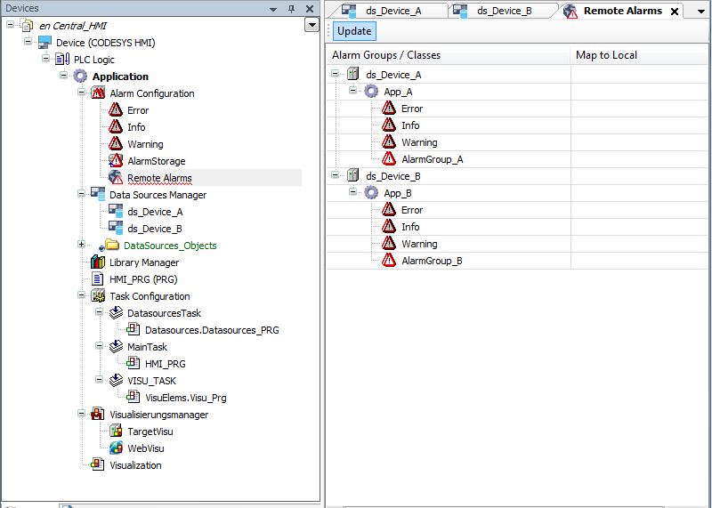

# Configuring remote alarms

You can configure an application with **alarm management for remote alarms** for an HMI device.

The local alarm configuration of the HMI is extended by the **Remote Alarms** object. Then the alarm system can process not only local alarms but also remote alarms and display their alarm information. Meanwhile, the remote alarms are connected to the HMI device via the data source management. The visualization of the HMI application can centrally display the alarms in the network. The user can acknowledge and react to these at a central location.

In the following instructions, the [Object: Remote Alarms](_cds_obj_remote_alarms.html#_cds_obj_remote_alarms) object is configured as an example.

Initial situation: Applications are running on remote PLCs in the network. Each of these applications has a configured alarm management and the `Alarm Configuration` object is available in the **Devices** view below the application.

1. On you local system, start an HMI runtime.
2. Click **Add** to confirm the dialog.

   * The local alarm configuration has been extended with the information from the alarm configurations of the applications `App_A` and `App_B`. The alarm management is distributed and communicates via the data source connections. Now the local HMI application can be downloaded to the CODESYS HMI runtime.

     In addition, you can create a visualization with the **Alarm Table** or **Alarm Banner** elements.

     

17.0

© Copyright 2026, CODESYS GmbH