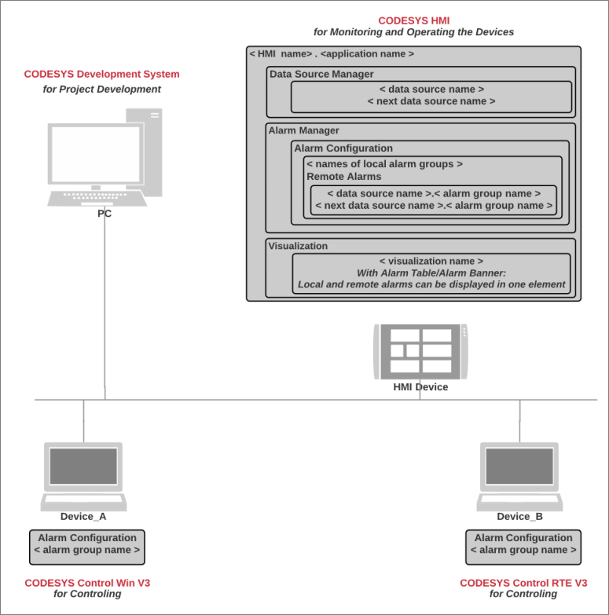

# Using HMI to Centrally Visualize Remote Alarms

If multiple devices are connected over a network (via data source connections) and an HMI device is connected in the network, then an alarm management for distributed alarms is possible in the HMI application.

The HMI device has a connection via the data source management to the devices in the network, each of which manages its own alarm. In order for the transmission of the remote alarms to the local HMI alarm management to be possible, you add a [Object: Remote Alarms](_cds_obj_remote_alarms.html#_cds_obj_remote_alarms) object to the local alarm management. This object mirrors the remote alarms (active and recorded) into the HMI at runtime.

On this basis, you can display the local alarms and the alarms of the remote devices centrally in a single alarm visualization (alarm table / alarm banner) on the HMI device.

The alarm recordings are stored directly on the controller where the application is also running.

17.0

© Copyright 2026, CODESYS GmbH