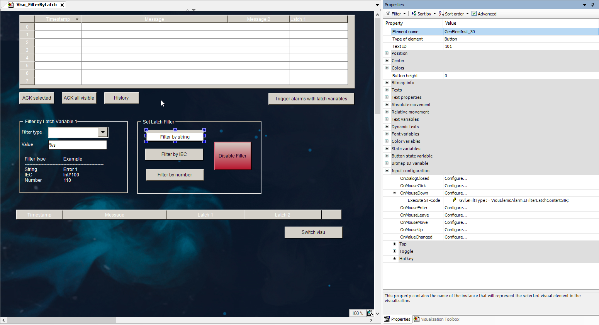

# Using Latch Variables to Filter Alarm Events

| NOTICE | |
| --- | --- |
|  | Sample project: [Filtering Alarms by Latch and Time Variables](https://content.helpme-codesys.com/de/CODESYS%20Examples/_ex_visu_alarm_filter_latch.html) |

When a large number of alarm events occur, it can be an advantage for the visualization user if that large number can be reduced by searching for a criterion such as the contents of a latch variable. For example, if the latch variable 1 contains the error number of the alarm, then the visualization user can filter by this. The user enters the number, which is then compared with the values of the latch variables of the alarms. Then only the alarm with this number is displayed.

Note that a match will only be detected if there is a full match between the filter criterion and the latch. Filtering with a partial search string or a wildcard is not possible. For example, if `1234` is the latch, then the alarm will be displayed only when filtering exactly by `'1234'`, but not when filtering by `'1'` or `'1*'`.

IMPORTANT:

**Behavior in the event of an unacknowledged alarm**

When an alarm definition has been configured with a latch variable, for example with an `INT` variable for a parameterized error message, the current value of the latch variable is archived at runtime. This value changes only if the associated alarm (error message) is acknowledged by the visualization user. The value of a latch variable is always updated when the alarm changes to the active state.

As a result, several consecutive error messages that have not yet been acknowledged get the incorrectly archived value. This applies not only to the initial transition to the active state, but also for example when a re-alarm is triggered.

The following instructions show you an example of how to configure the alarm definition for the search by criteria.

Configuration of alarm definitions for filters

1. In the application code, declare a string variable (`GVL`) for the filter. It should be possible to search for a specific error ID at runtime.

   * `sFilter : WSTRING;`

     The variable for the value being searched for is declared.

     This variable is used as an input variable for the search criterion to search for a string.
2. Program the alarm visualization for the **Rectangle**, **Button**, and **Alarm Table** visualization elements with an input configuration for the filter type as follows:

   1. Add a rectangle element for specifying the search string.

      * The rectangle element with the **Text** element property set to `%s` and **Text variable** element property set to `GVL.sFilter`.

        The visualization user can enter a search string at runtime.
   2. Add a button element with an input configuration for the filter start.

      * The **Write Variable** action is programmed for the filter variable in the input configuration:

        `GVL.sFilter`

        
   3. Configure the alarm table. In the visualization editor, select the element and configure its properties as follows:

      The **Alarm configuration** property → **Filter by latch1** → **Filter variable** is set to `GVL.sFilter`.

      The **Alarm configuration** property → **Filter by latch1** → **Filter type** is set to `GVL.eFiltType`.

      * The filtering is configured.

17.0

© Copyright 2026, CODESYS GmbH