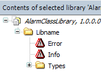

# Defining alarm classes centrally in library

You can define alarm classes centrally in a separate library. The advantage of this is that you can centrally define, change, and manage the properties and behavior of the alarm classes. The alarm classes are then referenced in implementation libraries, which consist of function blocks with the respective alarm group templates.

Alarm classes from other libraries must be listed with namespaces in order to avoid ambiguities with local alarm classes of the same name.

Because there is currently only one alarm memory, configuration in the alarm group is not necessary. The alarm class determines whether or not an alarm is saved.

The behavior of alarm classes can be centrally defined in libraries if library alarm classes are implemented, which can then be referenced in implementation libraries.

NOTE:

The previously predefined **Error**, **Info**, and **Warning** alarm classes below the alarm configuration can be deleted if only alarm classes from libraries should be used.

17.0

© Copyright 2026, CODESYS GmbH