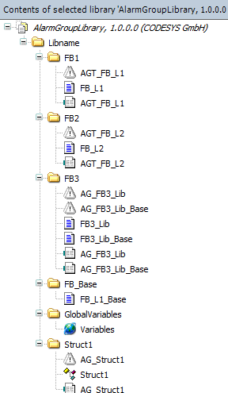

# Function block with inheritance

If you have a base function block which extends other function blocks, then you can also create an alarm group template for this base function block and define alarms there.

Alternatively, you could also create an alarm group template for a derived function block. It is also possible to access the variables of the base function block so that you can program alarm definitions for the inherited variables.

17.0

© Copyright 2026, CODESYS GmbH