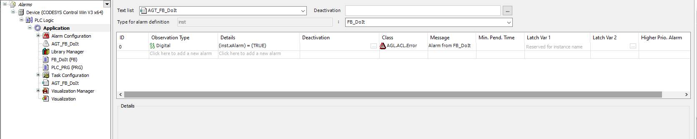

# Using function blocks with an alarm group template in a library

The alarm conditions for variables of the type can be defined in the alarm group templates.

1. Select your application.

   Click **Add Object → Alarm Group Template** and specify a name in the **Add Alarm Group Template** dialog.

   * The new alarm group template object `AGT_FB_DoIT` is created below your application.

     Hint: The object can also be stored under POUs.
2. **Under Details, define an alarm for the type:**

   * Under **Details**, program an alarm condition.
   * Under **Class**, specify an alarm class, ideally one from an alarm class library.
   * 

17.0

© Copyright 2026, CODESYS GmbH