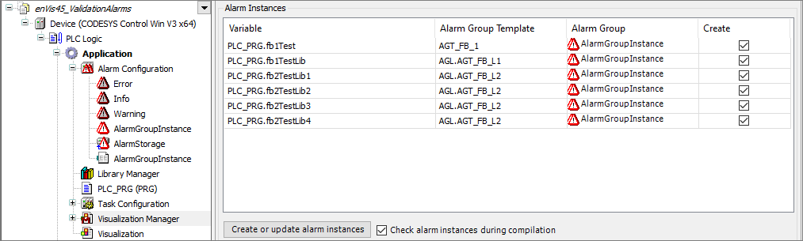

# Alarms in Library Projects

As a library developer, you can define alarm conditions for a specific function block or structure type.

In concrete terms, this means that you create an alarm group template object for the variables of such POUs and configure alarm definitions in them. The alarm group template object for the POU object is then located in parallel in the POU tree or device tree. The alarm definitions from this are later instantiated in the application in the [Alarm Configuration](_cds_obj_alarm_configuration.html#_cds_obj_alarm_configuration) object in order to perform an alarm check at runtime.

As an application developer, you can use library POUs which include alarm definitions for the supported creation of an alarm configuration. You will get support with alarm configuration throughout the entire development process of your application. Below your application, add an alarm configuration. A special generation cycle then creates the alarms for the instances of function blocks with alarm definitions. To do this, execute the **Create or update alarm instances** command so that alarm instances are also created for all instances.

You can continue with editing the alarm configuration. For example, you can deselect individual alarm instances.

To keep the application code consistent with the alarm configuration, the completeness and correctness of the alarm instances is checked when the IEC code is compiled. The result is displayed in the message view so that you are always informed about the state of the alarm configuration. If you do not want this, then you can disable the **Check alarm instances during compilation** option in the alarm configuration.

You can use the `alarm_creation_default` attribute pragma to control how the default for this instance should be with regard to creation.

Alarm Configuration 

For more information, see the following: [Object: Alarm Group Template](_cds_obj_alarm_group_template.html#_cds_obj_alarm_group_template), [Object: Alarm Configuration](_cds_obj_alarm_configuration.html#_cds_obj_alarm_configuration), and [Attribute: alarm\_creation\_default](_visu_pragma_alarm_creation_default.html#_visu_pragma_alarm_creation_default)

17.0

© Copyright 2026, CODESYS GmbH