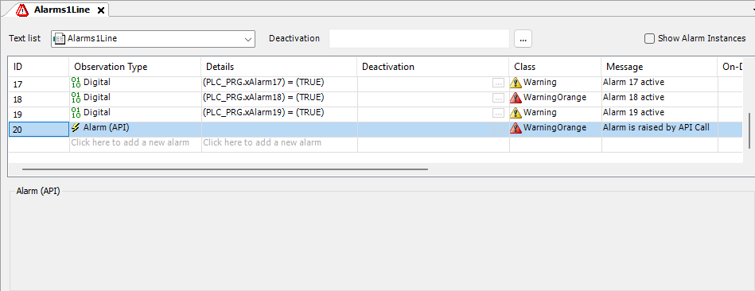

# Defining an alarm with **Alarm (API)** type

1. In `Alarm Configuration`, set an [alarm group](_cds_obj_alarm_group.html#_cds_obj_alarm_group).
2. In the **Class** column, select for example the alarm class `Warning Orange` and specify the desired alarm message under **Message**.

* The alarm `ID_20`, which is triggered via API, is defined.

  

You can define such an alarm with any alarm class. Details are not required, which means that an alarm condition is not given. The alarm is triggered via an API call.

17.0

© Copyright 2026, CODESYS GmbH