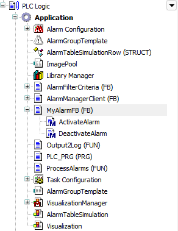
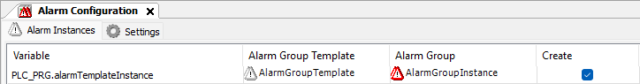

# Implementing a function block and an API call

**Step by step**

1. Add a function block to your application to set the alarm states of the newly defined alarm in the IEC code.

   1. Select the application node and click the **Add Object** → **POU** command.
   2. Configure the POU as follows: name `MyAlarmFB`, type **Function block**, implementation language **ST**.

      * Declaration

        ```
        FUNCTION_BLOCK MyAlarmFB
        VAR_INPUT
        END_VAR
        VAR_OUTPUT
        END_VAR
        VAR
        END_VAR
        ```
   3. Select the POU and add the `ActivateAlarm` and `DeactrivateAlarm` methods.
   4. Open the ST editor of the `ActivateAlarm` method and program the library call.

      TIP:

      Let the Input Assistant (**F2**) help you with this.

      * This code activates the alarm `ID_0` from the alarm group template.

        ```
        METHOD ActivateAlarm : BOOL
        VAR_INPUT
        END_VAR
        ```

        ```
        // Activate Alarm Instance Alarm by API Call
        Alarmmanager.AlarmGlobals.g_AlarmHandler.ActivateAlarmInstance(THIS, Alm_AlarmGroupTemplate_Alarm_IDs.ID_0);
        ```
   5. Open the ST editor of the `DesctivateAlarm` method and program the library call.

      * This code deactivates the alarm `ID_0` from the alarm group template `AGT`.

        ```
        METHOD DeactivateAlarm : BOOL
        VAR_INPUT
        END_VAR
        ```

        ```
        // Deactivate Alarm Instance Alarm by API Call
        Alarmmanager.AlarmGlobals.g_AlarmHandler.DeactivateAlarmInstance(THIS,Alm_AlarmGroupTemplate_Alarm_IDs.ID_0);
        ```

        Object navigator

        
2. Create the alarm instances.

   1. Open the `Alarm Configuration` editor and click the [Alarm Instances](23a367438cb587608bf5f707ef6c7195.html#UUID-55a87103-6385-0022-df19-8850343609e8_section-idm13405815832850) tab.
   2. Click the **Create or update alarm instances** button.
   * The alarm instances within the `Alarm Configuration` are recognized and updated.

     

17.0

© Copyright 2026, CODESYS GmbH