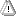

# Object: Alarm Group Template

Symbol: 

A **library developer** can use this object to define alarm conditions with variables of a custom type (function block or structure). The data type can be part of a development library. The variables of the function block can be checked for alarm conditions.

The object can be added in the **Devices** view, in the **POUs** view, or in libraries. A text list object with the same name is automatically created when it is added.

17.0

© Copyright 2026, CODESYS GmbH