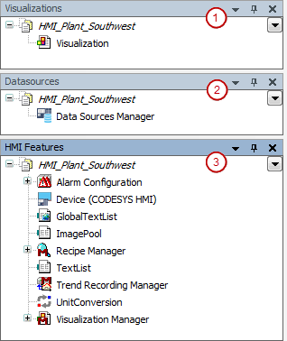

# Creating Initial HMI Projects

An wizard is available for the initial creation of an HMI project.

Initial situation: The controller to be displayed in a visualization is executed and connected to the controller network. The HMI device for which you program a new HMI application is also connected to the controller network.

1. Start the CODESYS Development System.
2. Click the **Exit** button.

   * The `HMI_Plant_Southwest` project is created and opened in CODESYS.

     

     + HMI Perspective:
     + (1): **Visualizations** view
     + (2): **Data Sources** view
     + (3): **HMI Features** view

17.0

© Copyright 2026, CODESYS GmbH