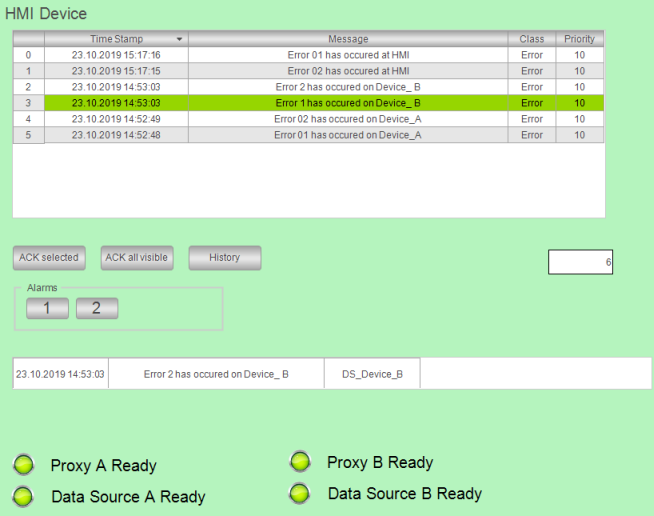

# Remote applications in the network

Initial situation: In your network, you have multiple PLCs whose applications (in addition to controller programs) each have their own alarm management. In the applications, the alarm conditions are checked and alarms are triggered if applicable. The alarm information is recorded. These remote applications are running (green and marked `[run]`).

The following image shows an example of such a network.

TIP:

If you add alarms in an alarm group on a remote PLC without subsequently updating the HMI application, then incorrect or incomplete displayed alarm information may be transmitted. This also happens when you add alarm classes or alarm groups on a remote PLC below an alarm configuration.

Therefore, we recommend that you update the HMI application after changes are made in a remote alarm configuration.

17.0

© Copyright 2026, CODESYS GmbH