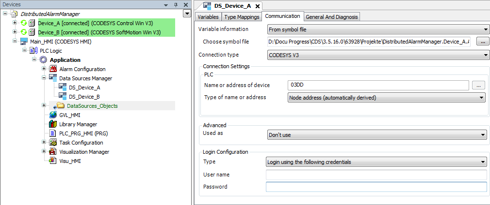

# Creating the HMI application

1. In the **Devices** view, select the top node `DistributedAlarmManager`.

   Click **Add Device**.

   * The dialog opens.
2. In the **Devices** view, select the application.

   Click **Add Object → Data Source Manager**.

   Select the new object and insert a data source below it for each remote PLC. Select a connection (example: **CODESYS Symbolic**).

   * The data source connections to the remote PLCs are configured.

     

     A connection to the remote devices is available via the data sources `DS_Device_A` and `DS_Device_B`. Now the alarm configuration can be extended.

     TIP:

     For a description of all options regarding how to set up data source connections, see the chapter "Data Source Manager".

17.0

© Copyright 2026, CODESYS GmbH