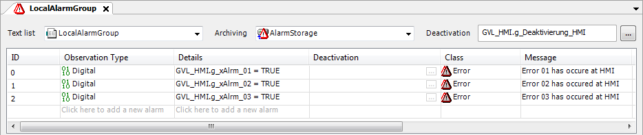

# Setting up a local alarm configuration

1. In the **Devices** view, select the HMI application.

   Click **Add Object → Alarm Configuration**.

   Select the new **Alarm Configuration** object and click **Add Object → Remote Alarms**.

   * The **Add Remote Alarms** dialog opens. The **Add all available alarm classes and groups** option is selected.
2. Below the alarm configuration, add a local alarm group `LocalAlarmGroup` and define alarms there.

   * Example:

     In this example, the alarm variables are declared globally in `GVL_HMI`.

     

The local alarm configuration of the HMI allows for access to local and remote alarm information. Alarm information is exchanged via proxy servers which are started for each data source. The alarm management is distributed.

Now you can create a visualization with the **Alarm Table** or **Alarm Banner** elements.

17.0

© Copyright 2026, CODESYS GmbH