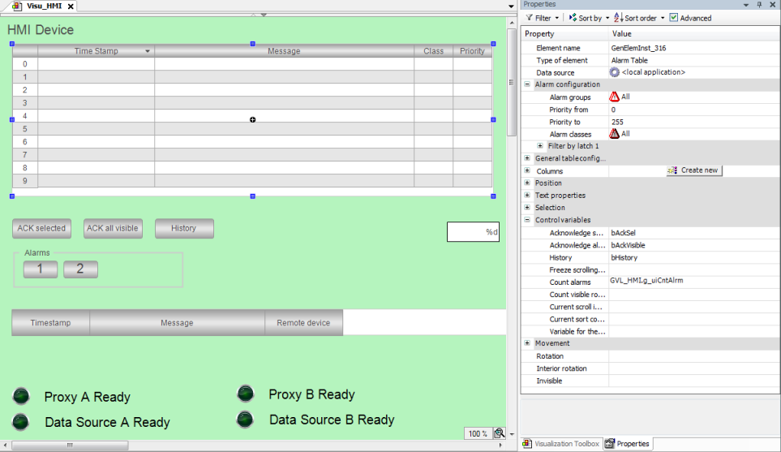

# Visualizing with an alarm table

1. Add a visualization below the application.
2. Configure the buttons.

   **First button:**

   * **Texts**, **Text** property: `Acknowledge Selected`
   * **Input configuration**, **Toggle** property: `bAckSel`

   **Second button:**

   * **Texts**, **Text** property: `Acknowledge All Visible`
   * **Input configuration**, **Toggle** property: `bAckVisible`

   **Third button:**

   * **Texts**, **Text** property: `historical Display`
   * **Input configuration**, **Toggle** property: `bHistory`
   * The alarm table is configured. The user can use the buttons to acknowledge the alarms.

     

17.0

© Copyright 2026, CODESYS GmbH