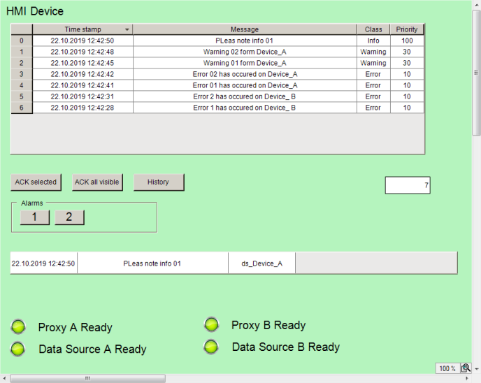

# Running the HMI application

Requirement: The applications have been downloaded to the remote PLCs and are running.

1. Click the  symbol.

   * The HMI application is compiled.
2. Click the start  symbol.

   * The HMI application is executed. The visualization starts. As soon as all proxy servers are active, all alarms distributed in the network are displayed centrally in the alarm element. The user can acknowledge the alarms centrally.

     Example:

     

     A visualization is running on the HMI device and has distributed alarm management (set up in the local alarm configuration) which exchanges information with remote alarm managements via data source connections. All alarms of a network are displayed together in an alarm table. The alarm element displays all alarms as you have configured in the local alarm configuration in the "**Remote Alarms**" object. This results in a uniform display of the alarms. You can also have the remote display options transferred and accepted.

17.0

© Copyright 2026, CODESYS GmbH