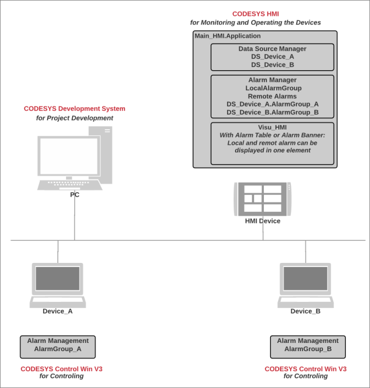

# Creating the User Interface for Distributed Alarm Management

You can create an application with distributed alarm management on an HMI device. Distributed alarm management means that both alarms that occur on the local device and alarms that occur on devices in the network are processed centrally. The alarm information is exchanged via data source connections, each of which is extended by a proxy server. For the alarm information, you can create a visualization which can display all alarms in the network in a single alarm element. This allows the user to monitor all devices in the network from a central location in a clearly organized visualization in one alarm element.

The following sections describe step-by-step how to create an HMI application with alarm visualization for networked PLCs.

17.0

© Copyright 2026, CODESYS GmbH