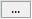

# Using an element without a valid signature

If an HTML5 control without a signature, with an invalid certificate, or with an invalid timestamp is part of your visualization, then a warning is displayed in the message view when the application code is generated.

In the message view, the  button is displayed after this warning. When you click the button, an input prompt is displayed. There you can set the element, which was warned about, to "accepted" in the project. Then this element will no longer be checked and you will not get any more warnings about it.

17.0

© Copyright 2026, CODESYS GmbH