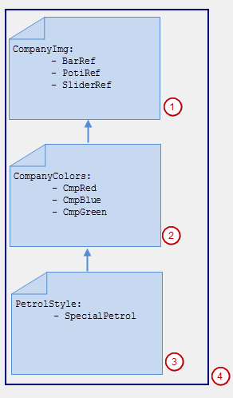

# Example of a style hierarchy

**Style: `Petrostyle`**

In a partial style, you can combine any style properties to form efficient hierarchies without having to worry about consistency. For example, you can collect all image references into one partial style. Then you derive the style and define more style properties for colors. This style is also partial. You derive the style again and define more style properties for its fonts. The top style is now completely.

* `CompanyImg` is a partial style defining image references.
* `CompanyColor` is a partial, derived style based on `CompanyImg` and also defines colors.
* `PetrolStyle` is a complete, derived style based on `CompanyColor` and also defines a special color.
* The hierarchy of styles comprises `PetrolStyle`, `CompanyColor`, and `CompanyImg`.

In the Visualization Style Editor, you can open a style, define its style properties, and localize its name. If the style is consistent, then you can install it in the Visualization Style Repository. The editor is not integrated in CODESYS Development System.

17.0

© Copyright 2026, CODESYS GmbH