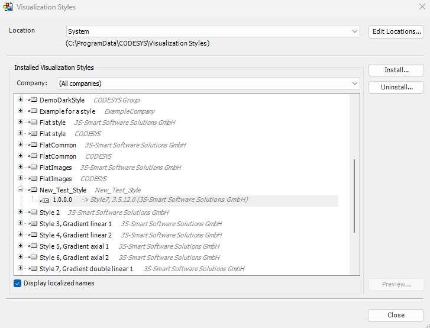

# Deriving visualization styles

TIP:

The is the recommended way to create a style that combines existing style properties with new ones.

**Starting the editor in CODESYS and deriving styles**

Requirement: CODESYS is open with a project containing a visualization.

1. Double-click the **Visualization Manager** object in the device tree.

   * The editor opens.
2. Provide a version for the style and click **File → Save and Install**.

   * The style is installed in the repository. The memory requirement is low because only the style property added in Step 7 is saved.

     

17.0

© Copyright 2026, CODESYS GmbH