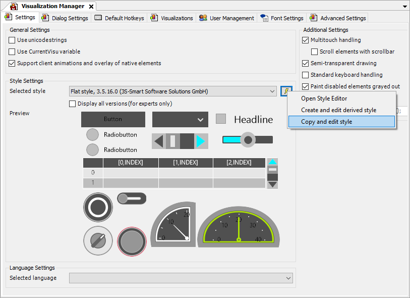
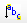

# Entries in the Visualization Style

The following describes those style entries which you as a user need to know in order to influence the appearance of the visualization or elements.

A visualization style can basically be edited with the **Visualization Style Editor**. You can call the editor in the Visualization Manager. If a style is preset there, then you can open the editor with that style to create a new style (derived from it). From our point of view, this is the easiest way to create your own visualization style.

Proceed as follows:

1. Select a visualization style which is closest to what you want.

   * 
2. Use the command icon  to toggle the insert mode.

   * The insert mode on the **Style Properties** tab is set to flat.

IMPORTANT:

When the insert mode is set to **flat**, you can apply the style entry names from the following tables.

17.0

© Copyright 2026, CODESYS GmbH