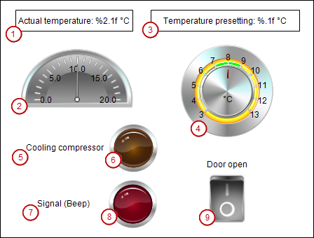

# Structure of the visualization `Visualization`

This screen consists of control and display elements for the refrigerator.

* : Numeric display of the actual temperature
* : Pointer to display of the actual temperature
* : Numeric display of the set temperature
* : Potentiometer for setting the set temperature
* : Label for compressor lamp
* : Lamp for compressor on
* : Label for signal lamp
* : Lamp for signal "Close doors"
* : Switch for opening and closing the refrigerator door

1. Open the visualization `Visualization` in the editor.
2. Drag a **[Rocker Switch](_visu_elem_switch.html#_visu_elem_switch)** visualization element to the editor.

   **Change the following properties**

   * **Variable**: `Glob_Var.rDoorOpen`

17.0

© Copyright 2026, CODESYS GmbH