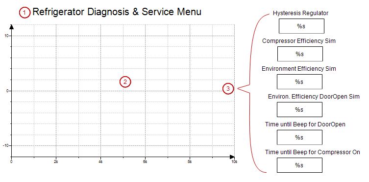

# Structure of the visualization `Diagnosis`

In this screen, you can monitor the temperature curve and optimize the parameters.

* **[Label](_visu_elem_label.html#_visu_elem_label)**  elements for the headline
* **[Trace](_visu_elem_trace.html#_visu_elem_trace)**  element for displaying the temperature curve
* **[Rectangle](_visu_elem_rectangle.html#_visu_elem_rectangle)**  elements for displaying the value

1. Open the visualization `Diagnosis` in the editor.
2. **Adjust the labels and variables of the copied elements.**

   * **Text**: `Compressor Efficiency`

     **Text variable**: `Simulation.P_Cooling`
   * **Text**: `Environment Efficiency`

     **Text variable**: `Simulation.P_Environment`
   * **Text**: `Environ. Efficiency DoorOpen Sim`

     **Text variable**: `Simulation.P_EnvironmentDoorOpen`
   * **Text**: `Time until Beep for DoorOpen`

     **Text variable**: `Glob_Var.timDoorOpenThreshold`
   * **Text**: `Time until Beep for Compressor On`

     **Text variable**: `Glob_Var.timAlarmThreshold`

17.0

© Copyright 2026, CODESYS GmbH